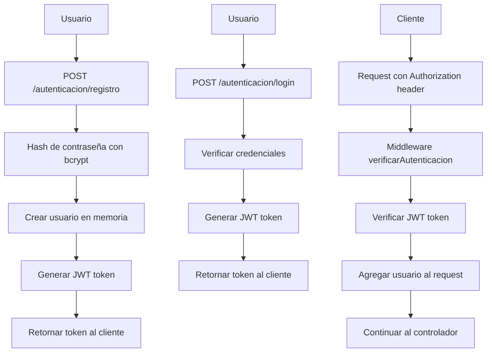

# Workout Tracker API - Documentación Técnica

## 📁 Estructura del Proyecto

```
workout-tracker/
├── src/
│   ├── app.js                          # Punto de entrada de la aplicación
│   ├── config/
│   │   └── env.js                      # Configuración de variables de entorno
│   ├── controllers/                     # Controladores de la lógica de negocio
│   │   ├── autenticacion.controller.js # Manejo de JWT y autenticación
│   │   ├── users.controller.js         # CRUD de usuarios
│   │   ├── ejercicios.controller.js    # CRUD de ejercicios
│   │   ├── rutinas.controller.js       # CRUD de rutinas de entrenamiento
│   │   ├── asociacion-rutina-ejercicio.controller.js # Asociación rutina-ejercicio
│   │   ├── horario-entrenamiento.controller.js # CRUD de horarios
│   │   └── resumen-desempeno-progreso.controller.js # CRUD de progreso
│   ├── middleware/                      # Middleware personalizado
│   │   ├── auth.middleware.js          # Middleware de autenticación
│   │   └── authorization.middleware.js # Middleware de autorización
│   ├── routes/                         # Definición de rutas
│   │   ├── index.js                    # Rutas principales
│   │   └── v1/                         # Versión 1 de la API
│   │       ├── index.js                # Agregador de rutas v1
│   │       ├── autenticacion.routes.js # Rutas de autenticación
│   │       ├── users.routes.js         # Rutas de usuarios
│   │       ├── ejercicios.routes.js    # Rutas de ejercicios
│   │       ├── rutinas.routes.js       # Rutas de rutinas
│   │       ├── asociacion-rutina-ejercicio.routes.js # Rutas de asociación
│   │       ├── horario-entrenamiento.routes.js # Rutas de horarios
│   │       └── resumen-desempeno-progreso.routes.js # Rutas de progreso
│   └── seeders/                        # Datos de prueba
│       └── ejercicios.seeder.js        # Sembrador de ejercicios
├── docs/
│   └── exercises.md                    # Documentación de endpoints
├── package.json                        # Dependencias y scripts
└── README.md                          # Documentación de usuario
```

## 🏗️ Arquitectura del Sistema

### **Patrón MVC (Model-View-Controller)**
- **Modelos**: Arrays en memoria (simulan base de datos)
- **Vistas**: Respuestas JSON
- **Controladores**: Lógica de negocio en `/controllers`

### **Middleware Stack**
1. **Helmet**: Seguridad HTTP
2. **CORS**: Control de acceso cross-origin
3. **Morgan**: Logging de requests
4. **Express.json()**: Parseo de JSON
5. **Autenticación JWT**: Verificación de tokens
6. **Autorización**: Verificación de permisos por usuario

## 🔐 Sistema de Autenticación

### **Flujo de Autenticación**


### **Estructura del Token JWT**
```json
{
  "id": "usuario_id",
  "email": "usuario@email.com",
  "rol": "usuario",
  "iat": 1234567890,
  "exp": 1234567890
}
```

## 📊 Modelos de Datos

### **1. Usuario**
```javascript
{
  id: "string",
  nombre: "string",
  email: "string",
  contraseña: "string (hasheada)",
  rol: "usuario|admin",
  fechaCreacion: "ISO string"
}
```

### **2. Ejercicio**
```javascript
{
  id: "string",
  nombre: "string",
  grupoMuscular: "pecho|espalda|piernas|hombros|brazos|core|general",
  categoria: "fuerza|cardio|flexibilidad",
  dificultad: "facil|intermedio|avanzado",
  descripcion: "string",
  instrucciones: "string",
  fechaCreacion: "ISO string"
}
```

### **3. Rutina**
```javascript
{
  id: "string",
  usuarioId: "string", // FK a Usuario
  nombre: "string",
  dificultad: "facil|intermedio|avanzado",
  descripcion: "string",
  duracionEstimada: "number (minutos)",
  categoria: "fuerza|cardio|flexibilidad|mixto|general",
  fechaCreacion: "ISO string"
}
```

### **4. Asociación Rutina-Ejercicio**
```javascript
{
  id: "string",
  rutinaId: "string", // FK a Rutina
  ejercicioId: "string", // FK a Ejercicio
  series: "number",
  repeticiones: "number",
  peso: "number (kg)",
  tiempoDescanso: "number (segundos)",
  orden: "number",
  notas: "string",
  fechaCreacion: "ISO string"
}
```

### **5. Horario de Entrenamiento**
```javascript
{
  id: "string",
  usuarioId: "string", // FK a Usuario
  rutinaId: "string", // FK a Rutina
  fecha: "YYYY-MM-DD",
  horaInicio: "HH:MM",
  horaFin: "HH:MM",
  estado: "programado|en_progreso|completado|cancelado",
  notas: "string",
  recordatorio: "boolean",
  fechaCreacion: "ISO string"
}
```

### **6. Progreso**
```javascript
{
  id: "string",
  usuarioId: "string", // FK a Usuario
  horarioId: "string", // FK a Horario
  rutinaId: "string", // FK a Rutina
  fecha: "YYYY-MM-DD",
  duracionReal: "number (minutos)",
  caloriasQuemadas: "number",
  peso: "number (kg)",
  notas: "string",
  ejerciciosCompletados: [
    {
      ejercicioId: "string",
      series: "number",
      repeticiones: "number",
      peso: "number",
      completado: "boolean",
      pesoUsado: "number",
      repeticionesRealizadas: "number"
    }
  ],
  fechaCreacion: "ISO string"
}
```

## 🔄 Operaciones CRUD

### **Patrón CRUD Estándar**
Cada recurso implementa las siguientes operaciones:

| Método | Endpoint | Descripción | Autenticación |
|--------|----------|-------------|---------------|
| GET | `/recurso` | Listar todos | ✅ |
| GET | `/recurso/:id` | Obtener uno | ✅ |
| POST | `/recurso` | Crear nuevo | ✅ |
| PUT | `/recurso/:id` | Actualizar completo | ✅ |
| PATCH | `/recurso/:id` | Actualizar parcial | ✅ |
| DELETE | `/recurso/:id` | Eliminar | ✅ |

### **Filtros y Búsquedas**
- **Query Parameters**: `?campo=valor&busqueda=termino&limite=10`
- **Filtros específicos** por recurso
- **Paginación** con límite
- **Ordenamiento** por fecha/orden

## 🛡️ Sistema de Autorización

### **Niveles de Acceso**
1. **Público**: Solo autenticación (registro, login)
2. **Usuario Autenticado**: Acceso a sus propios datos
3. **Admin**: Acceso completo (futuro)

### **Middleware de Autorización**
```javascript
// Verificar que el usuario solo accede a SUS datos
function verificarPropietario(req, res, next) {
  const usuarioId = req.usuario.id;
  const recursoUsuarioId = req.params.usuarioId || req.body.usuarioId;
  
  if (usuarioId !== recursoUsuarioId) {
    return res.status(403).json({ error: 'Sin permisos' });
  }
  next();
}
```

## 📈 Flujo de Datos

### **1. Registro de Usuario**
```
Cliente → POST /autenticacion/registro → Controlador → Hash contraseña → Crear usuario → JWT → Respuesta
```

### **2. Crear Rutina**
```
Cliente → POST /rutinas (con JWT) → Middleware Auth → Controlador → Agregar usuarioId → Crear rutina → Respuesta
```

### **3. Agregar Ejercicio a Rutina**
```
Cliente → POST /rutinas/:id/ejercicios (con JWT) → Middleware Auth → Verificar propietario → Crear asociación → Respuesta
```

### **4. Registrar Progreso**
```
Cliente → POST /resumen-desempeno-progreso (con JWT) → Middleware Auth → Verificar propietario → Crear progreso → Respuesta
```

## 🔧 Configuración y Variables

### **Variables de Entorno**
```javascript
{
  PORT: 3000,
  JWT_SECRET: "clave_secreta",
  JWT_EXPIRES_IN: "24h",
  NODE_ENV: "development"
}
```

### **Dependencias Principales**
- **express**: Framework web
- **jsonwebtoken**: Manejo de JWT
- **bcryptjs**: Hash de contraseñas
- **cors**: Control CORS
- **helmet**: Seguridad HTTP
- **morgan**: Logging
- **dotenv**: Variables de entorno

## 🚀 Scripts Disponibles

```bash
# Desarrollo
npm run dev          # Con nodemon (auto-reload)

# Producción
npm start            # Node directo

# Verificar
node src/app.js      # Ejecutar directamente
```

## 📝 Logs y Debugging

### **Morgan Logging**
- **Formato**: `combined`
- **Información**: IP, método, URL, status, tiempo
- **Ejemplo**: `127.0.0.1 - - [01/Oct/2025:22:30:45 +0000] "GET /api/v1/ejercicios HTTP/1.1" 200 1234`

### **Manejo de Errores**
```javascript
// Respuesta estándar de error
{
  "error": "Descripción del error"
}

// Códigos HTTP
200: OK
201: Created
204: No Content
400: Bad Request
401: Unauthorized
403: Forbidden
404: Not Found
500: Internal Server Error
```

## 🔄 Estados y Validaciones

### **Estados de Horarios**
- `programado`: Entrenamiento programado
- `en_progreso`: Entrenamiento en curso
- `completado`: Entrenamiento completado
- `cancelado`: Entrenamiento cancelado

### **Validaciones de Datos**
- **Email**: Formato válido
- **Fecha**: YYYY-MM-DD
- **Hora**: HH:MM
- **Campos requeridos**: Validación obligatoria
- **Tipos de datos**: Conversión automática

## 🎯 Características Técnicas

### **Rendimiento**
- **Almacenamiento**: En memoria (rápido)
- **Búsquedas**: Filtros en JavaScript
- **Respuestas**: JSON optimizado

### **Seguridad**
- **JWT**: Tokens seguros con expiración
- **bcrypt**: Hash de contraseñas
- **Helmet**: Headers de seguridad
- **CORS**: Control de origen
- **Validación**: Input sanitization

### **Escalabilidad**
- **Modular**: Controladores separados
- **Middleware**: Reutilizable
- **Rutas**: Organizadas por versión
- **Configuración**: Centralizada

## 🧪 Testing y Desarrollo

### **Estructura para Testing**
```
tests/
├── unit/           # Tests unitarios
├── integration/    # Tests de integración
└── fixtures/       # Datos de prueba
```

### **Datos de Prueba**
- **Sembrador**: 30+ ejercicios predefinidos
- **Usuario demo**: `estiven@example.com` / `password`
- **Datos de ejemplo**: En cada controlador

## 📚 Documentación Adicional

- **Endpoints**: Ver `docs/exercises.md`
- **Ejemplos**: Ver `README.md`
- **API Reference**: Disponible en `/api`

---

**Desarrollado con ❤️ usando Node.js + Express + JWT**

